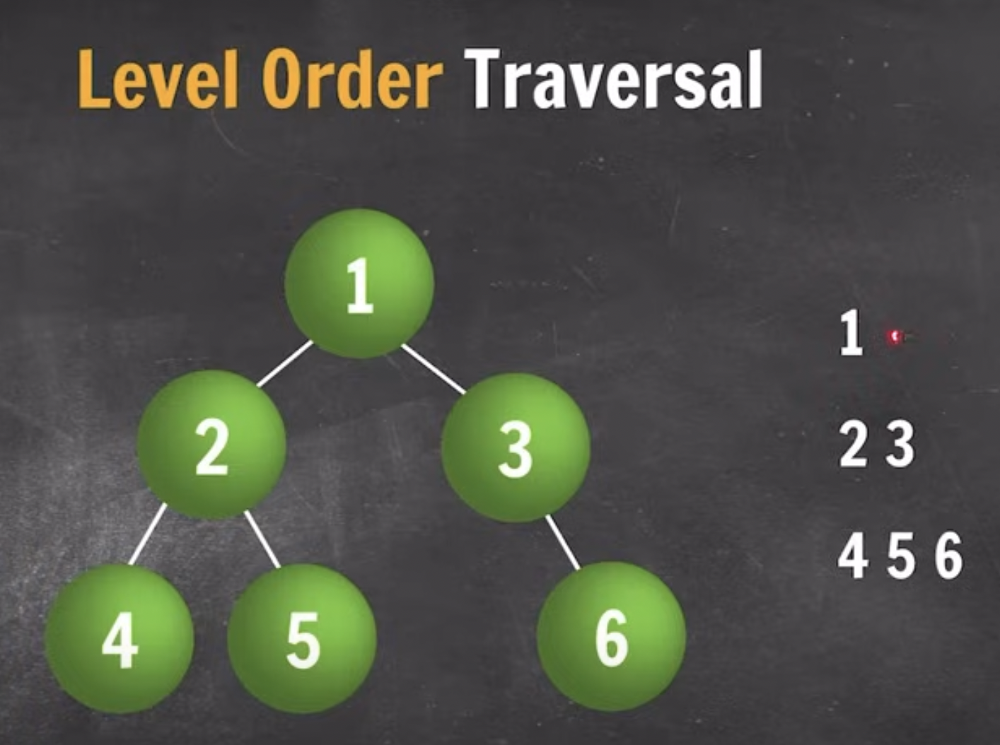

# Trees

- A tree data structure is a hierarchical structure that is used to represent and organize data in a way that is easy to navigate and search.

## Binary Search Tree (BST)

- Makes search efficient
- at most 2 nodes
- average search time O(height).
- i.e., O(logn) in balanced binary tree.
- O(n) in skewed trees

## Traversal in Binary Search Tree and Binary Tree in general

- All traversal code in Trees.java file.

1. Preorder

- Root --> Left --> Right

  ```bash
  private void preOrder(Node root) {
      if (root == null) {
          return;
      }

      System.out.print(root.data + " ");
      preOrder(root.leftNode);
      preOrder(root.rightNode);
  }
  ```

2. Inorder

- Left --> Root --> Right

  ```bash
  private void inOrder(Node root) {
      if (root == null) {
          return;
      }

      inOrder(root.leftNode);
      System.out.print(root.data + " ");
      inOrder(root.rightNode);
  }
  ```

- [inorder]() traversal of a BST will always gives you a [sorted sequence]().

3. Postorder

- Left --> Right --> Root

  ```bash
  private void postOrder(Node root) {
      if (root == null) {
          return;
      }

      postOrder(root.leftNode);
      postOrder(root.rightNode);
      System.out.print(root.data + " ");
  }
  ```

4. Level Order

- cannot use recurssion. [BFS]()
- data is printed level wise
- 1 2 3 4 5 6
  

  ```bash
    private void levelOrder(Node root) {

        if (root == null)
            return;

        Queue<Node> queue = new LinkedList<Node>();
        queue.add(root);
        queue.add(null);

        while (!queue.isEmpty()) {
            Node top = queue.remove();
            if (top == null) {
                System.out.println();
                if (queue.isEmpty()) {
                    break;
                } else {
                    queue.add(null);
                }
            } else {
                System.out.print(top.data);

                if (top.leftNode != null) {
                    queue.add(top.leftNode);
                }

                if (top.rightNode != null) {
                    queue.add(top.rightNode);
                }
            }
        }
    }
  ```

## Strategy

- Most of the problems will be solved using recurssion i.e., by dividing into subproblems & making recurssive calls on subtree.

## Building a Binary Search Tree (BST)

```bash
public class trees {
    private static class Node {
        int data;
        Node leftNode;
        Node rightNode;

        public Node(int data) {
            this.data = data;
        }
    }

# inserting a node in bst
    private static Node insert(Node root, int val) {
        if (root == null) {
            root = new Node(val);
            return root;
        }

        if (val < root.data) {
            root.leftNode = insert(root.leftNode, val);
        } else {
            root.rightNode = insert(root.rightNode, val);
        }

        return root;
    }

    private static void inorder(Node root) {
        if (root == null) {
            return;
        }

        inorder(root.leftNode);
        System.out.print(root.data + " ");
        inorder(root.rightNode);
    }

    public static void main(String[] args) {

        int[] values = { 5, 1, 3, 4, 2, 7 };
        Node root = null;

        for (int val : values) {
            root = insert(root, val);
        }

        inorder(root);
    }

}
```

## Searching a Binary Search Tree (BST)

```bash
private static boolean bst(Node root, int val) {
    if (root == null) {
        return false;
    }

    if (root.data == val) {
        return true;
    }

    if (val < root.data) {
        return bst(root.leftNode, val);
    } else {
        return bst(root.rightNode, val);
    }
}
```

## Deleting a node in Binary Search Tree (BST)

- Cases:
  - Case1: Leaf Node
  - Case2: One child
  - Case3: two child
    - replace value with inorder successor (leftmost node in right subtree).
    - Inorder successor always has 0 or 1 child.

```bash
// deleting a node in bst
private static Node delete(Node root, int val) {
    // search the node to be deleted
    if (val < root.data) {
        root.leftNode = delete(root.leftNode, val);
    } else if (val > root.data) {
        root.rightNode = delete(root.rightNode, val);
    } else { // root.data == val
                // Case 1: node is leaf node
        if (root.leftNode == null && root.rightNode == null) {
            return null;
            // Case 2: node has 1 child
        } else if (root.leftNode == null) {
            return root.rightNode;
        } else if (root.rightNode == null) {
            return root.leftNode;
        }

        // Case 3: node has 2 child
        Node successor = inorderSuccessor(root.rightNode);
        root.data = successor.data;
        root.rightNode = delete(root.rightNode, successor.data);
    }

    return root;
}

// Function to find the inorder successor of the node
private static Node inorderSuccessor(Node root) {
    while (root.leftNode != null) {
        root = root.leftNode;
    }
    return root;
}
```

inorder successor is the leftmost node in the right subtree

### Print In Range (X , Y) inclusive


```bash
private static void printInRange(Node root, int X, int Y) {
    if (root == null) {
        return;
    }

    if (root.data >= X && root.data <= Y) {
        printInRange(root.leftNode, X, Y);
        System.out.print(root.data + " ");
        printInRange(root.rightNode, X, Y);
    } else if (root.data >= Y) {
        printInRange(root.leftNode, X, Y);
    } else {
        printInRange(root.rightNode, X, Y);
    }
}
```

### Print Paths from Root to leaf nodes

```bash
private static void printRoot2LeafPaths(Node root, ArrayList<Integer> path) {

    if (root == null) {
        return;
    }

    path.add(root.data);

    if (root.leftNode == null && root.rightNode == null) {
        System.out.println(path);
    } else {
        printRoot2LeafPaths(root.leftNode, path);
        printRoot2LeafPaths(root.rightNode, path);
    }

    path.remove(path.size() - 1);
}
```

## -------------------- BINARY TREES ----------------


### Build binary tree when nodes given in preorder fashion

```bash
int[] nodes = { 1, 2, 4, -1, -1, 5, -1, -1, 3, -1, 6, -1, -1 };
BinaryTree tree = new BinaryTree();
Node root = tree.buildTree(nodes);
```

```bash
private Node buildTree(int[] nodes) {
    idx++;
    if (nodes[idx] == -1) {
        return null;
    }

    Node newNode = new Node(nodes[idx]);
    newNode.leftNode = buildTree(nodes);
    newNode.rightNode = buildTree(nodes);

    return newNode;
}
```

### Height of a Binary Tree

```bash
private int heightOfTree(Node root) {
    if (root == null)
        return 0;

    return 1 + Math.max(heightOfTree(root.leftNode), heightOfTree(root.rightNode));
}
```

## Find Diameter of a Tree

```bash
# snapdeal and adobe
# ---------- O(n^2) ----------
private int diameterOfTree(Node root) {
    if (root == null)
        return 0;

    int leftSubtree = diameterOfTree(root.leftNode);
    int rightSubtree = diameterOfTree(root.rightNode);
    int diameterFromRoot = heightOfTree(root.leftNode) + heightOfTree(root.rightNode) + 1;

    return Math.max(Math.max(leftSubtree, rightSubtree), diameterFromRoot);
}

# ---------- O(n) ----------
# class to store TreeInfo
private static class TreeInfo {
    int height;
    int diameter;

    public TreeInfo(int height, int diameter) {
        this.height = height;
        this.diameter = diameter;
    }

}

private TreeInfo diameterOfTreeOptimized(Node root) {
    if (root == null)
        return new TreeInfo(0, 0);

    TreeInfo leftInfo = diameterOfTreeOptimized(root.leftNode);
    TreeInfo rightInfo = diameterOfTreeOptimized(root.rightNode);

    int currheight = Math.max(leftInfo.height, rightInfo.height) + 1;
    int currdiameter = Math.max(Math.max(leftInfo.diameter, rightInfo.diameter),
            leftInfo.height + rightInfo.height + 1);

    return new TreeInfo(currheight, currdiameter);

}
```

## Is given subTree a part of RootTree

```bash
# --------- helper function ---------
private boolean isIdentical(Node root, Node subRoot) {

    if (root == null && subRoot == null)
        return true;

    if (root == null || subRoot == null)
        return false;

    if (root.data == subRoot.data) {
        return isIdentical(root.leftNode, subRoot.leftNode) && isIdentical(root.rightNode, subRoot.rightNode);
    }

    return false;
}

# --------- main function ---------
private boolean isSubtree(Node root, Node subRoot) {
    if (subRoot == null)
        return true;

    if (root == null)
        return false;

    if (root.data == subRoot.data) {
        if (isIdentical(root, subRoot)) {
            return true;
        }
    }

    return isSubtree(root.leftNode, subRoot) || isSubtree(root.rightNode, subRoot);

}
```

## Sum of all nodes values at level K

[HINT: ~ level order traversal]()

```bash
private int sumAtLevelK(Node root, int k) {
    if (root == null)
        return 0;

    if (k == 1) {
        return root.data;
    }

    Queue<Node> queue = new LinkedList<Node>();
    queue.add(root);
    queue.add(null);

    int sum = 0;
    int level = 1;
    while (!queue.isEmpty()) {
        Node top = queue.remove();

        if (top == null) {
            level++;
            if (level == k + 1) {
                return sum;
            }
            sum = 0;
            queue.add(null);
        } else {
            sum += top.data;
            if (top.leftNode != null)
                queue.add(top.leftNode);
            if (top.rightNode != null)
                queue.add(top.rightNode);
        }
    }

    return sum;

}
```
