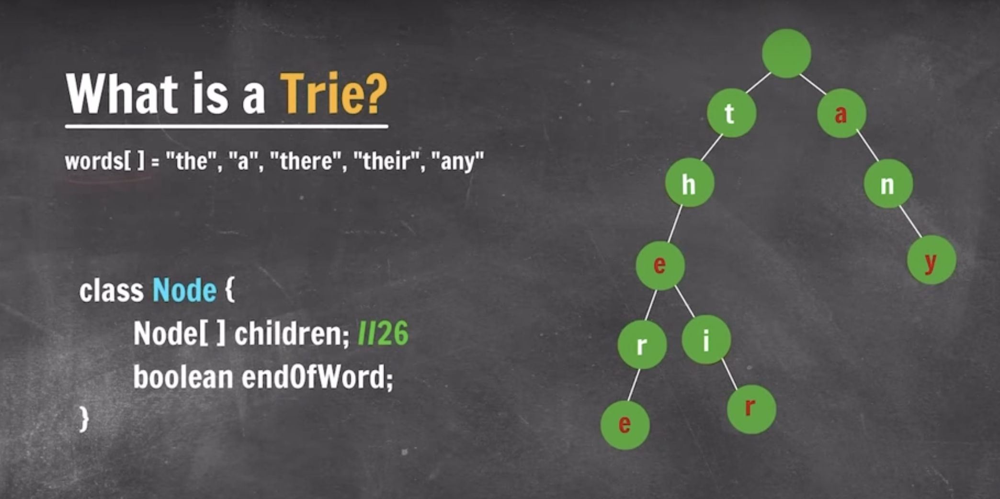
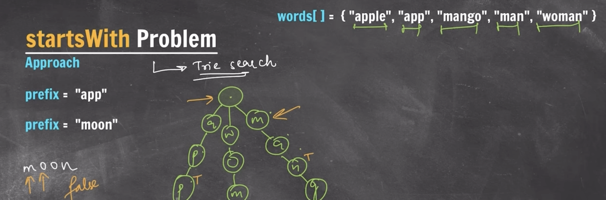

## Tries

- Unique Prefix Tree
- Digital Search Tree
- Retrieval Tree
- k-ary Tree
- better than bst for search
- root is empty node
- time complexity => O(L) where L: length of word

[Apna College Link click here](https://youtu.be/m9zawMC6QAI?si=8ULJy_6GEZ29sZc0)



### Creating a Trie

```bash
package Tries;

public class tries {

    static class Node {
        Node[] children;
        boolean eow;

        public Node() {
            children = new Node[26];
            for (int i = 0; i < 26; i++) {
                children[i] = null;
            }
            eow = false;
        }

        static Node root = new Node();
    }

    public static void main(String[] args) {
        String[] words = { "the", "there", "a", "their", "any" };
    }
}
```

### Inserting in a Trie

```bash
private static void insert(String word) {
    Node current = root;
    for (int i = 0; i < word.length(); i++) {
        int idx = word.charAt(i) - 'a'; // 'a' - 'a' = 0
        if (current.children[idx] == null) {
            current.children[idx] = new Node();
        }

        if (i == word.length() - 1) {
            current.children[idx].eow = true;
        }

        current = current.children[idx];
    }
}
```

### Searching in a Trie

```bash
private static boolean search(String word) {
    Node current = root;
    for (int i = 0; i < word.length(); i++) {
        int idx = word.charAt(i) - 'a';
        if (current.children[idx] == null) {
            return false;
        }

        if (i == word.length() - 1 && current.children[idx].eow == false) {
            return false;
        }

        current = current.children[idx];
    }

    return true;
}
```

## Problem

### Word Break


```bash
public static boolean checkWordBreak(TrieNode root, String key){

    if(key.length() == 0){
        return true;
    }

    boolean[] dp = new boolean[key.length()];
    for(int i = 0; i < key.length(); i++){
        if(i == 0 || dp[i-1]){
            TrieNode curr = root;
            for(int j = i; j < key.length(); j++){
                int idx = key.charAt(j) - 'a';
                if(curr.children[idx] == null){
                    break;
                }

                curr = curr.children[idx];
                if(curr.eow){
                    dp[j] = true;
                }
            }
        }

    }


    return dp[key.length() - 1];
}
```

### StartsWith given Prefix



```bash
private static boolean startsWith(String prefix) {
    Node curr = root;

    for (int i = 0; i < prefix.length(); i++) {
        int idx = prefix.charAt(i) - 'a';
        if (curr.children[idx] == null) {
            return false;
        }

        curr = curr.children[idx];
    }

    return true;
}
```

### Common Prefix


```bash
public String longestCommonPrefix(String[] strs) {
    if(strs.length == 0){
        return "";
    }

    // Assument strs[0] to be prefix
    String prefix = strs[0];

    for(int i = 1; i < strs.length; i++){
        // checking if strs[i] contains prefix ?
        while(strs[i].indexOf(prefix) != 0){
            // if not then reduce prefix
            prefix = prefix.substring(0, prefix.length() - 1);

            // if prefix is 0 after reducing then there is no common prefix
            if(prefix.isEmpty()){
                return "";
            }

        }
    }

    return prefix;
}
```

### Count Unique Substrings


Concept -> all unique prefix of all suffix

Steps:

1. Find all suffix
2. Create Trie from all suffix
3. Count Nodes of Tries.

- All nodes stored in Trie are unique prefix.

- Hence Total_nodes_of_Trie = count_of_unique_prefix.

```bash

# inserting all suffix inside Trie
String str = "apple";
for (int i = 0; i < str.length(); i++) {
    String substring = str.substring(i);
    insert(substring);
}

System.out.println(countNodes(root));

# Actual recursive function to calculate total nodes
private static int countNodes(Node root) {
    if (root == null) {
        return 0;
    }

    int count = 0;
    for (int i = 0; i < 26; i++) {
        if (root.children[i] != null) {
            count += countNodes(root.children[i]);
        }
    }

    return count + 1;
}
```

### Longest Word with all prefixes


```bash
# Longest word with all prefix
String words[] = { "a", "banana", "app", "appl", "ap", "apply", "apple" };
for (String word : words) {
    insert(word);
}

longestword(root, new StringBuilder(""));
System.out.println(longestStringWithAllPrefix);


# Static variable to give the final answer
private static String longestStringWithAllPrefix = "";

# Actual recursive function to calculate the longes word with all prefix
private static void longestword(Node root, StringBuilder sb) {
    if (root == null) {
        return;
    }

    for (int i = 0; i < 26; i++) {
        if (root.children[i] != null && root.children[i].eow == true) {
            sb.append((char) (i + 'a'));
            if (sb.length() > longestStringWithAllPrefix.length()) {
                longestStringWithAllPrefix = sb.toString();
            }
            longestword(root.children[i], sb);

            sb.deleteCharAt(sb.length() - 1);
        }
    }
}

```
