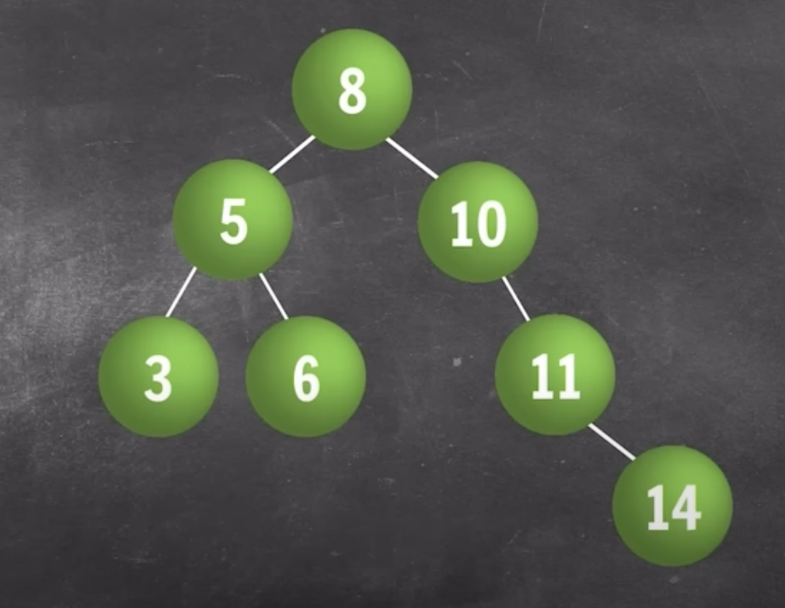

# Trees

- A tree data structure is a hierarchical structure that is used to represent and organize data in a way that is easy to navigate and search.

## Binary Search Tree (BST)

- Makes search efficient
- at most 2 nodes
- average search time O(height).
- i.e., O(logn) in balanced binary tree.
- O(n) in skewed trees

## Traversal in Binary Search Tree

1. Preorder

- Root --> Left --> Right

2. Inorder

- Left --> Root --> Right
- [inorder]() traversal of a BST will always gives you a [sorted sequence]().

3. Postorder

-

4. Level Order

-

## Strategy

- Most of the problems will be solved using recurssion i.e., by dividing into subproblems & making recurssive calls on subtree.

## Building a Binary Search Tree (BST)

```bash
public class trees {
    private static class Node {
        int data;
        Node leftNode;
        Node rightNode;

        public Node(int data) {
            this.data = data;
        }
    }

# inserting a node in bst
    private static Node insert(Node root, int val) {
        if (root == null) {
            root = new Node(val);
            return root;
        }

        if (val < root.data) {
            root.leftNode = insert(root.leftNode, val);
        } else {
            root.rightNode = insert(root.rightNode, val);
        }

        return root;
    }

    private static void inorder(Node root) {
        if (root == null) {
            return;
        }

        inorder(root.leftNode);
        System.out.print(root.data + " ");
        inorder(root.rightNode);
    }

    public static void main(String[] args) {

        int[] values = { 5, 1, 3, 4, 2, 7 };
        Node root = null;

        for (int val : values) {
            root = insert(root, val);
        }

        inorder(root);
    }

}
```

## Searching a Binary Search Tree (BST)

```bash
private static boolean bst(Node root, int val) {
    if (root == null) {
        return false;
    }

    if (root.data == val) {
        return true;
    }

    if (val < root.data) {
        return bst(root.leftNode, val);
    } else {
        return bst(root.rightNode, val);
    }
}
```

## Deleting a node in Binary Search Tree (BST)

- Cases:
  - Case1: Leaf Node
  - Case2: One child
  - Case3: two child
    - replace value with inorder successor (leftmost node in right subtree).
    - Inorder successor always has 0 or 1 child.

```bash
// deleting a node in bst
private static Node delete(Node root, int val) {
    // search the node to be deleted
    if (val < root.data) {
        root.leftNode = delete(root.leftNode, val);
    } else if (val > root.data) {
        root.rightNode = delete(root.rightNode, val);
    } else { // root.data == val
                // Case 1: node is leaf node
        if (root.leftNode == null && root.rightNode == null) {
            return null;
            // Case 2: node has 1 child
        } else if (root.leftNode == null) {
            return root.rightNode;
        } else if (root.rightNode == null) {
            return root.leftNode;
        }

        // Case 3: node has 2 child
        Node successor = inorderSuccessor(root.rightNode);
        root.data = successor.data;
        root.rightNode = delete(root.rightNode, successor.data);
    }

    return root;
}

// Function to find the inorder successor of the node
private static Node inorderSuccessor(Node root) {
    while (root.leftNode != null) {
        root = root.leftNode;
    }
    return root;
}
```

inorder successor is the leftmost node in the right subtree

### Print In Range (X , Y) inclusive



```bash
private static void printInRange(Node root, int X, int Y) {
    if (root == null) {
        return;
    }

    if (root.data >= X && root.data <= Y) {
        printInRange(root.leftNode, X, Y);
        System.out.print(root.data + " ");
        printInRange(root.rightNode, X, Y);
    } else if (root.data >= Y) {
        printInRange(root.leftNode, X, Y);
    } else {
        printInRange(root.rightNode, X, Y);
    }
}
```
